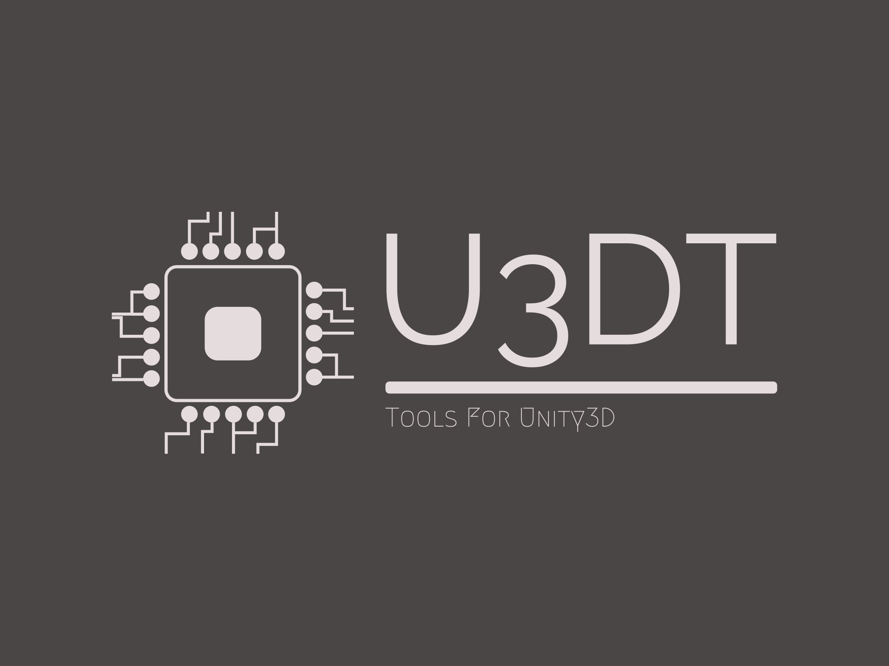

<center><br/>
Open Source, git based development framework for Unity3D. With some basic functionality scripts.

</center><br/>

___

## Developers:<br/>
### Name:<br/>
_Anton Stechman_<br/>
### Role:<br/>
_Owner/Lead Developer_<br/>
### Links:<br/>
<a href="https://www.github.com/Anton-Stechman/">GitHub</a><br/>
<a href="https://www.linkedin.com/in/anton-stechman/">LinkedIn</a><br/>
___

## Find Support:
<a href="">Discord</a><br/>
___

## Initial Setup Instructions:

Open Windows Powershell adminisitrator and execute the below command:
```
Set-ExecutionPolicy -ExecutionPolicy Unrestricted
```

### Environment Requirements:
- Unity3D version 2021.3.21f1 <br/>
[Download](https://unity.com/releases/editor/archive)
- python version 3.10.0 <br/>
[Download](https://www.python.org/downloads/release/python-3100/)
- git version 2.40.0 <br/>
[Download](https://git-scm.com/download/win)

#### Python Modules:
- Colorama
```
pip install colorama
```
___

## Links
<a href="https://www.github.com/Anton-Stechman/U3DTools/tree/main">U3DT GitHub</a><br/>
<a href="https://git-scm.com/book/en/v2/Getting-Started-Installing-Git">Installing Git</a><br/>
<a href="https://www.unity.com">Unity3D Website</a><br/>
___
